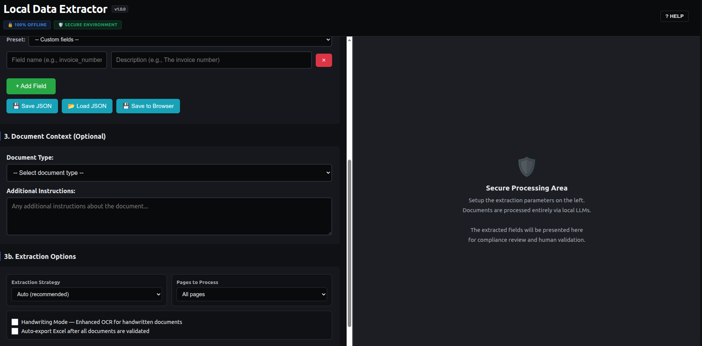

# Local Data Extractor 📄⚡

> **NEW: Use a Remote DGX as Your Local Vision LLM Provider!**
>
> You can connect the extractor to a powerful remote DGX (or any server with GPUs) running [Ollama](https://ollama.ai) and use it as your private LLM Vision backend—directly from your laptop or office PC. This enables blazing-fast, enterprise-grade document extraction with full privacy, as all data stays within your network. Just set the `OLLAMA_BASE_URL` to your DGX/server IP, or change it live from the web UI!


A 100% privacy-compliant, local AI-powered document extraction tool. Perfect for public administrations, law firms, and anyone handling sensitive data. It uses Vision LLMs (like Qwen, Llama3.2-Vision, DeepSeek) through [Ollama](https://ollama.ai) to extract structured data from any PDF or image into Excel, without ever sending your data to the cloud.



## Features 🚀

- **100% Privacy & Local Executed:** No data leaves your machine/network. Essential for GDPR compliance.
- **Zero-Shot Extraction:** No need to map coordinate templates. The AI "reads" the document naturally.
- **Hub & Spoke Architecture Ready:** Run Ollama on a single powerful server (Hub) and access the web UI from any office laptop (Spoke) by pointing the UI to your server's IP.
- **Handwriting Support:** Specially tuned prompts to decode difficult handwritten fields.
- **Human-in-the-Loop Validation:** An elegant side-by-side UI to verify and edit the AI's extraction before exporting to Excel.
- **Smart Model Auto-Fallback:** Optimized logic for dealing with LLM quirks, markdown block stripping, and empty JSON freezes.

---

## Quick Start ⏱️

### Prerequisites
1. Install [Ollama](https://ollama.com/download) on your local machine or a server.
2. Install Python 3.10+
3. Install `poppler-utils` (Required for PDF processing)
   - **Ubuntu/Debian:** `sudo apt-get install poppler-utils`
   - **macOS:** `brew install poppler`
   - **Windows:** Download Poppler for Windows and add to PATH.

### Installation & Run

We've provided a simple script to set up everything automatically:

```bash
# 1. Clone the repository
git clone https://github.com/your-username/local_data_extractor.git
cd local_data_extractor

# 2. Start the application (Installs deps automatically on first run)
./start.sh

# 3. To gracefully stop the application running in background
./stop.sh
```

`start.sh` will:
1. Create a virtual environment and install dependencies.
2. Start the Flask backend.
3. Automatically open `http://localhost:5000` in your browser.

---

## Manual Setup ⚙️

If you prefer to set up manually or you are on Windows:

```bash
# 1. Create & activate virtual environment
python3 -m venv .venv
source .venv/bin/activate        # On Windows: .venv\Scripts\activate

# 2. Install dependencies
pip install -r requirements.txt

# 3. Pull a recommended vision model
ollama pull qwen3.5:4b           # Great for standard laptops
# ollama pull llama3.2-vision:11b # Great for 12GB+ VRAM

# 4. Start the application
python src/app.py
```

---


## Configuration 🛠️

You can configure the application using environment variables or a `.env` file (copy `.env.example` to `.env`):

```env
OLLAMA_BASE_URL=http://localhost:11434    # Point this to your remote DGX / Server IP to use a remote GPU as your LLM Vision provider
OLLAMA_MODEL=llama3.2-vision:11b          # Default model
PORT=5000                                 # Web UI port
```

**Note:** You can also dynamically change the Ollama IP (including a remote DGX or server) and the Model directly from the Web Interface without restarting the application!

---

## Project Structure 📁

```text
local_data_extractor/
├── src/
│   ├── app.py                 # Flask server and routing
│   ├── processor.py           # Core OCR / AI logic, image resizing, and parsing
│   ├── models_config.py       # Model catalog and hardware recommendations
│   └── templates/
│       └── index.html         # Frontend Vanilla JS / HTML
├── start.sh                   # One-click start script
├── stop.sh                    # One-click script to stop the backend
├── setup.sh                   # Environment setup script
├── requirements.txt           # Python dependencies
└── README.md                  # This file
```

---

## License 📜

Distributed under the MIT License. See `LICENSE` for more information.
