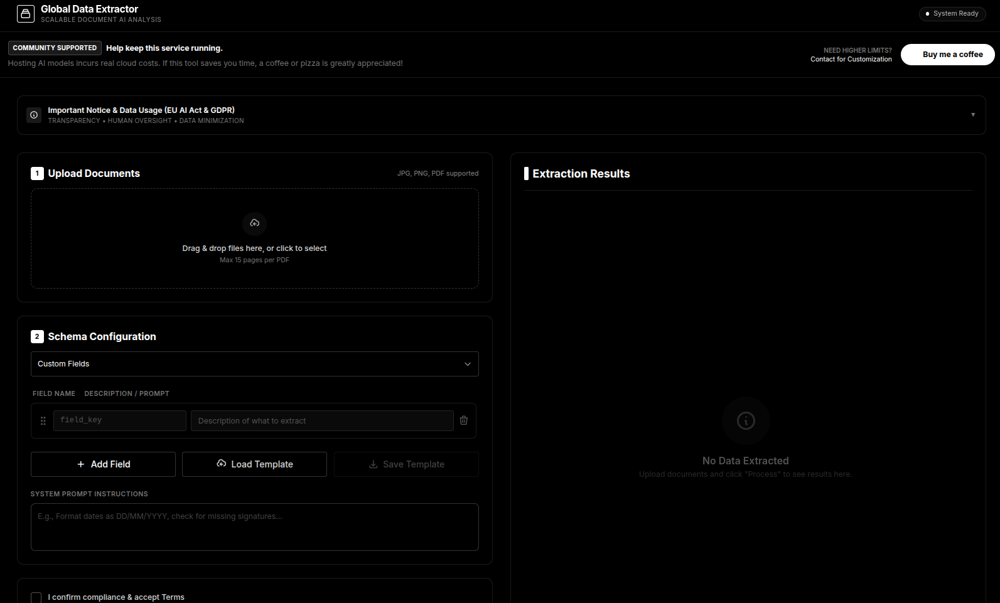

<p align="center">
  <h1 align="center">Local Document Data Extractor</h1>
  <p align="center">
    <strong>Turn unstructured documents into structured Excel data — entirely on your machine.</strong>
  </p>
  <p align="center">
    <a href="https://opensource.org/licenses/MIT"></a>
    <a href="https://www.python.org/downloads/"></a>
    <a href="https://ollama.ai/"></a>
    <a href="https://flask.palletsprojects.com/"></a>
  </p>
</p>

<br>

> Upload any PDF or image. Tell the app what data you need. Get a clean Excel file back.
> No cloud, no API keys, no data leaving your computer — ever.

<p align="center">
  
</p>

---

## Why This Exists

Organisations deal with mountains of unstructured documents every day — invoices, receipts, contracts, ID cards, handwritten forms. Extracting data from them usually means one of two things:

1. **Manual data entry** — slow, expensive, error-prone.
2. **Cloud AI services** — fast, but your sensitive documents travel to third-party servers.

This tool offers a third option: **run a vision-language model on your own hardware**, point it at your documents, describe the fields you need, and export the results to Excel. Everything stays local.

It works well today with mid-range models like `gemma3:27b` on a 24 GB GPU. As NPUs and unified-memory architectures become mainstream, tools like this will become practical on everyday laptops — making local AI extraction accessible to everyone.

---

## Key Features

| | Feature | Description |
|---|---|---|
| 🎯 | **Dynamic field definition** | No training, no templates to build. Just describe what you want in natural language. |
| 🖥️ | **100 % local** | Ollama runs the model on your machine. Nothing is sent to the internet. |
| 📄 | **Multi-format input** | PDFs (multi-page), JPEG, PNG — drag & drop one or many files. |
| 📊 | **Excel export** | One-click export of validated extractions to `.xlsx`, formatted and ready to use. |
| ✏️ | **Inline validation** | Review, edit, and validate each extraction before exporting. |
| ⚡ | **Incremental results** | Documents are processed one by one; results appear in the review panel as they complete, so you can start checking immediately. |
| 🤖 | **Multiple extraction strategies** | *Single Pass* (fast), *OCR → Extract* (two-phase, best quality), or *Auto*. |
| ✍️ | **Handwriting mode** | Enhanced prompts and image processing tuned for handwritten documents. |
| 🗂️ | **Template presets** | Built-in templates (Invoice, CV, ID Card, Contract, Receipt, Codice Fiscale) + save your own to localStorage or JSON. |
| 🎨 | **Dark / Light theme** | Toggle between themes; preference is persisted. |
| 🖥️ | **GPU auto-detection** | Reads your NVIDIA GPU(s) via `nvidia-smi`, shows VRAM, recommends the best model. |
| 🔌 | **REST API** | Every feature is available via HTTP — integrate it into your own pipeline. |
| 📦 | **Model management** | Browse installed models, pull new ones, switch models live — all from the UI. |

---

## Quick Start

```bash
# 1. Install Ollama (if you haven't already)
curl -fsSL https://ollama.ai/install.sh | sh
ollama serve                              # start the Ollama server

# 2. Pull a vision model
ollama pull gemma3:27b                    # best quality  (needs ~24 GB VRAM)
# or
ollama pull llama3.2-vision:11b           # great balance  (needs ~12 GB VRAM)
# or
ollama pull gemma3:4b                     # lighter option (needs ~6 GB VRAM)

# 3. Clone and run
git clone https://github.com/mcaronna-dev/local_data_extractor.git
cd local_data_extractor/Ollama
./setup.sh            # creates venv, installs deps, checks system
python app.py         # starts the web UI on http://localhost:5000
```

Open **http://localhost:5000** and you're ready.

---

## How It Works

```
 ┌─────────────┐     ┌──────────────────┐     ┌─────────────────┐     ┌──────────┐
 │  Upload PDF  │────▶│  Image pipeline   │────▶│  Ollama vision   │────▶│  Review   │
 │  or Image    │     │  (enhance, OCR)   │     │  model (local)   │     │  & Edit   │
 └─────────────┘     └──────────────────┘     └─────────────────┘     └────┬─────┘
                                                                           │
                                                                    ┌──────▼──────┐
                                                                    │ Export .xlsx │
                                                                    └─────────────┘
```

1. **Upload** — Drag & drop PDFs or images into the browser.
2. **Define fields** — Describe each piece of data you need (e.g. *"Invoice number"*, *"Total amount including tax"*).
3. **Extract** — The app converts each page to an optimised image, sends it to your local Ollama model, and parses the structured JSON response.
4. **Review** — Results appear incrementally in the right-hand validation panel. Edit any value, see the document preview side by side, mark as validated.
5. **Export** — Download all validated rows as a formatted Excel file.

### Extraction Strategies

| Strategy | How it works | When to use |
|---|---|---|
| **Single Pass** | Vision model reads the image and outputs structured JSON directly. | Fast; good for printed documents with a capable model. |
| **OCR → Extract** | Phase 1: vision model performs raw OCR. Phase 2: a text LLM structures the OCR output into JSON. | Best quality for complex or handwritten documents. |
| **Auto** *(default)* | Picks the best strategy based on model type and settings. | Recommended for most users. |

---

## Model Guide

The app works with any Ollama vision model. Pick one based on your GPU memory:

| Model | VRAM | Speed | Quality | Notes |
|---|---|---|---|---|
| **gemma3:27b** | ~24 GB | Slow | ⭐ Excellent | Best local quality — 81 % accuracy on handwritten Italian Codice Fiscale. |
| **llama3.2-vision:11b** | ~12 GB | Medium | Excellent | Best overall balance of speed and accuracy. |
| **gemma3:12b** | ~13 GB | Medium | Excellent | Strong single-GPU alternative. |
| **qwen3-vl:8b** | ~8 GB | Medium | Very Good | Multilingual strength. |
| **deepseek-ocr:latest** | ~8 GB | Fast | Very Good | OCR-specialist model. |
| **glm-ocr:latest** | ~3 GB | Very Fast | Outstanding OCR | #1 on OmniDocBench — pure OCR tasks. |
| **gemma3:4b** | ~6 GB | Fast | Good | Lightweight; runs on most GPUs. |
| **llava:7b** | ~7 GB | Medium | Good | Classic general-purpose vision model. |

> **Tip:** The UI auto-detects your GPU(s) and recommends a model. You can also switch models per-request without restarting the server.

---

## REST API

Every feature is also available via HTTP for scripting or integration.

### Extract data

```bash
curl -X POST http://localhost:5000/extract \
  -F 'files=@invoice.pdf' \
  -F 'fields_to_extract={
        "invoice_number": "The invoice or reference number",
        "date": "Invoice date in DD/MM/YYYY format",
        "total": "Total amount including tax",
        "vendor": "Name of the issuing company"
      }'
```

### Advanced options

```bash
curl -X POST http://localhost:5000/extract \
  -F 'files=@handwritten_form.pdf' \
  -F 'fields_to_extract={"codice_fiscale": "Italian fiscal code, 16 alphanumeric characters"}' \
  -F 'extraction_strategy=ocr_then_extract' \
  -F 'handwriting_mode=true' \
  -F 'page_range=first' \
  -F 'model=gemma3:27b'
```

### Other endpoints

| Method | Endpoint | Description |
|---|---|---|
| `GET` | `/health` | Health check |
| `GET` | `/models/available` | All installed Ollama models (with vision flag) |
| `GET` | `/models/current` | Currently selected model |
| `POST` | `/models/set` | Change active model |
| `POST` | `/models/pull` | Download a new model from Ollama registry |
| `GET` | `/models/families` | Model families with small / medium / large tiers |
| `GET` | `/gpu/detect` | Detected GPUs, VRAM, and recommended model |
| `POST` | `/export-excel` | Export validated results to `.xlsx` |

---

## Project Structure

```
Ollama/
├── app.py                 # Flask server — routes, API, Excel export
├── processor.py           # Image pipeline, OCR, Ollama integration
├── models_config.py       # Model catalogue, hardware recommendations
├── requirements.txt       # Python dependencies
├── setup.sh               # One-command setup (venv, deps, model pull)
├── start.sh               # Quick launch script
├── .env.example           # Configuration template
└── templates/
    └── index.html         # Complete web UI (single-file, no build step)
```

### Tech Stack

- **Runtime:** Python 3.8+, Flask
- **AI backbone:** [Ollama](https://ollama.ai/) — local vision-language model inference
- **PDF handling:** pdf2image + Pillow (image enhancement for OCR)
- **Excel export:** openpyxl (styled, colour-coded spreadsheets)
- **Frontend:** Vanilla HTML / CSS / JavaScript — zero build tools, zero npm, just open the browser

---

## Configuration

Copy `.env.example` to `.env` and adjust as needed:

```bash
# Ollama server
OLLAMA_BASE_URL=http://localhost:11434

# Default model (can be changed from the UI at any time)
OLLAMA_MODEL=llama3.2-vision:11b

# Flask
PORT=5000
```

---

## System Requirements

| | Minimum | Recommended |
|---|---|---|
| **OS** | Linux, macOS, Windows (WSL) | Linux |
| **RAM** | 8 GB | 16 GB+ |
| **GPU** | Optional (CPU works, just slower) | NVIDIA with 12+ GB VRAM |
| **Disk** | 10 GB free (for models) | 30 GB+ |
| **Software** | Python 3.8+, Ollama, poppler-utils | Same |

### Install poppler (PDF support)

```bash
# Ubuntu / Debian
sudo apt-get install poppler-utils

# macOS
brew install poppler

# Fedora
sudo dnf install poppler-utils
```

---

## Troubleshooting

| Problem | Solution |
|---|---|
| *"Ollama not found"* | Install Ollama: `curl -fsSL https://ollama.ai/install.sh \| sh` then `ollama serve` |
| *"No vision models"* | Pull one: `ollama pull gemma3:4b` |
| *"PDF processing error"* | Install poppler-utils (see above) |
| *Out of memory* | Use a smaller model, or close other GPU-heavy apps |
| *Slow performance* | Check `nvidia-smi` — make sure the model fits in VRAM; CPU offload is much slower |

---

## Looking Ahead

Today, running a 27-billion-parameter vision model locally requires a dedicated GPU with 24 GB of VRAM — that's enthusiast-grade hardware. But the landscape is shifting fast:

- **NPUs** (Neural Processing Units) are shipping in consumer laptops and will keep getting faster.
- **Unified memory architectures** (Apple Silicon, upcoming AMD/Intel designs) let models use system RAM seamlessly, removing the VRAM bottleneck.
- **Model quantisation** keeps improving — what needed 24 GB yesterday fits in 12 GB today.

The goal of this project is to be ready for that future: a simple, privacy-first tool that anyone can run on their own machine to turn messy documents into clean, structured data — no cloud account required.

---

## Cloud Version

Want to try the concept without installing anything? A cloud-hosted version (powered by Gemini on Google Cloud) is available:

**[Global Data Extractor — Live Demo](https://global-data-extractor-gui-371839762470.us-west1.run.app/)**

<p align="center">
  
</p>

> ⚠️ The demo runs on paid infrastructure — please use it responsibly.

---

## Contributing

Contributions are welcome — bug reports, feature ideas, code, docs. See [CONTRIBUTING.md](CONTRIBUTING.md) for guidelines.

```bash
# Fork, clone, branch
git checkout -b feature/my-improvement

# Make changes, test
python app.py   # manual test
./test.sh       # automated tests

# Commit and open a PR
git commit -m "feat: my improvement"
git push origin feature/my-improvement
```

---

## License

MIT — see [LICENSE](LICENSE).

---

<p align="center">
  <sub>Built by <a href="https://github.com/mcaronna-dev">Mario Caronna</a> — for anyone who believes their data should stay on their machine.</sub>
</p>
